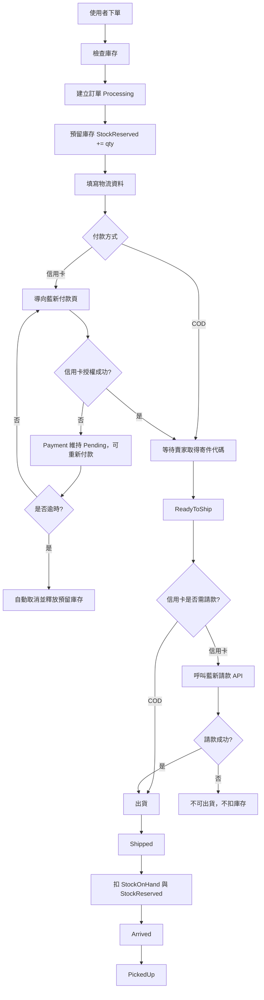

# ConvenienceStoreOrderService｜賣家後台訂單管理系統

使用 ASP.NET MVC5、EF6、SQL Server 開發賣家後台訂單管理系統，實作訂單、物流、付款、退款四條狀態線，支援庫存預留/扣庫存/退貨回補、COD 與藍新信用卡付款、請款、退款、取消授權，以及 Hangfire 逾時自動取消排程。

專案重點有以下幾點：

- 下單後預留庫存
- 出貨時正式扣庫存
- 寄件前取消釋放預留庫存
- 出貨後退貨回補實際庫存
- COD 與信用卡付款流程分流
- 藍新信用卡授權、請款、退款、取消授權
- Hangfire 背景排程處理逾時訂單

---

## 使用技術

| 類別     | 技術                                          |
| -------- | --------------------------------------------- |
| 後端     | ASP.NET MVC5、C#                              |
| ORM      | Entity Framework 6                            |
| 資料庫   | SQL Server                                    |
| 前端     | Razor View、Bootstrap                         |
| DI       | Unity                                         |
| 背景排程 | Hangfire                                      |
| 金流     | 藍新金流信用卡一次付清                        |
| CI/CD    | GitHub Actions、Self-hosted Runner、Local IIS |

---

## 專案亮點

### 1. 訂單、物流、付款、退款狀態分離

專案將狀態拆成四條線處理：

| 狀態線         | 用途                               |
| -------------- | ---------------------------------- |
| OrderStatus    | 訂單目前走到哪個階段               |
| ShipmentStatus | 物流目前走到哪個階段               |
| PaymentStatus  | 是否待付款、已付款或已取消         |
| RefundStatus   | 是否需要退款、退款申請中或退款完成 |

這樣可以避免把「已付款」、「已退貨」、「已退款」全部塞在同一個訂單狀態裡，導致狀態混亂。

---

### 2. 庫存預留與正式扣庫存

```text
庫存不是下單時直接扣掉，而是分成：
StockReserved預留庫存、StockOnHand實際庫存
可售庫存為：StockOnHand -StockReserved
在下單時會檢查可售庫存，這樣可以避免下單後立刻扣實際庫存，也能處理取消訂單與退貨回補。
```

| 時機       | 庫存處理                                     |
| ---------- | -------------------------------------------- |
| 下單成功   | `StockReserved += qty`                       |
| 出貨成功   | `StockOnHand -= qty`、`StockReserved -= qty` |
| 寄件前取消 | `StockReserved -= qty`                       |
| 出貨後退貨 | `StockOnHand += qty`                         |

---

### 3. 藍新信用卡金流流程

信用卡付款流程分成：

```text
信用卡授權成功
→ 出貨前請款
→ 請款成功才出貨
→ 出貨後退貨才退款
```

也就是說，信用卡交易成功後不立刻請款，而是在出貨前才呼叫請款 API。  
如果請款失敗，訂單不可出貨，也不會扣庫存。

---

### 4. 取消、退貨、退款分流

| 情境                   | 處理方式                     |
| ---------------------- | ---------------------------- |
| 未付款取消             | 取消訂單，釋放預留庫存       |
| 信用卡已授權未請款取消 | 先取消授權，成功後才取消訂單 |
| COD 未取貨退回         | 未收款，不需退款             |
| COD 已付款退貨         | 建立人工退款申請             |
| 信用卡已請款後退貨     | 呼叫藍新退款 API             |

---

### 5. Hangfire 背景排程

| Job                                     | 用途                               |
| --------------------------------------- | ---------------------------------- |
| `auto-cancel-expired-unpaid-orders`     | 信用卡付款逾時未成功，自動取消訂單 |
| `auto-cancel-expired-incomplete-orders` | 物流資料逾時未填，自動取消訂單     |
| `clear-expired-shipping-codes`          | 寄件代碼逾期未寄件，自動清除       |

---

## 系統流程簡圖



## 專案資料夾結構

```text
ConvenienceStoreOrderService
├── Controllers
├── Services
├── Repositories
├── Models
│   ├── EFModels
│   ├── DTOs
│   ├── ViewModels
│   ├── Constants
│   └── Helpers
├── Jobs
├── Views
└── App_Start
```

---

## CI/CD

本專案使用 GitHub Actions 建立 CI/CD 流程：

| 流程 | 說明                                                            |
| ---- | --------------------------------------------------------------- |
| CI   | Push 或 Pull Request 時，自動還原 NuGet、MSBuild 建置專案       |
| CD   | 手動觸發 GitHub Actions，透過 Self-hosted Runner 部署到本機 IIS |

---
