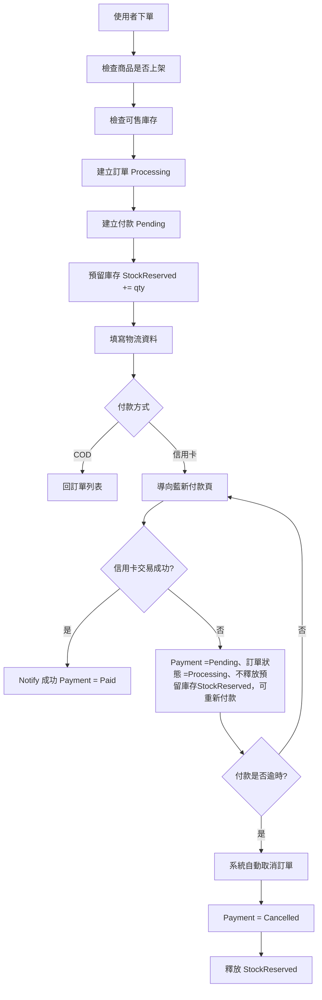
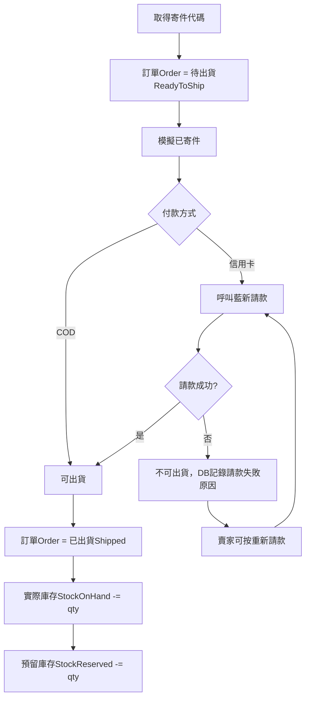
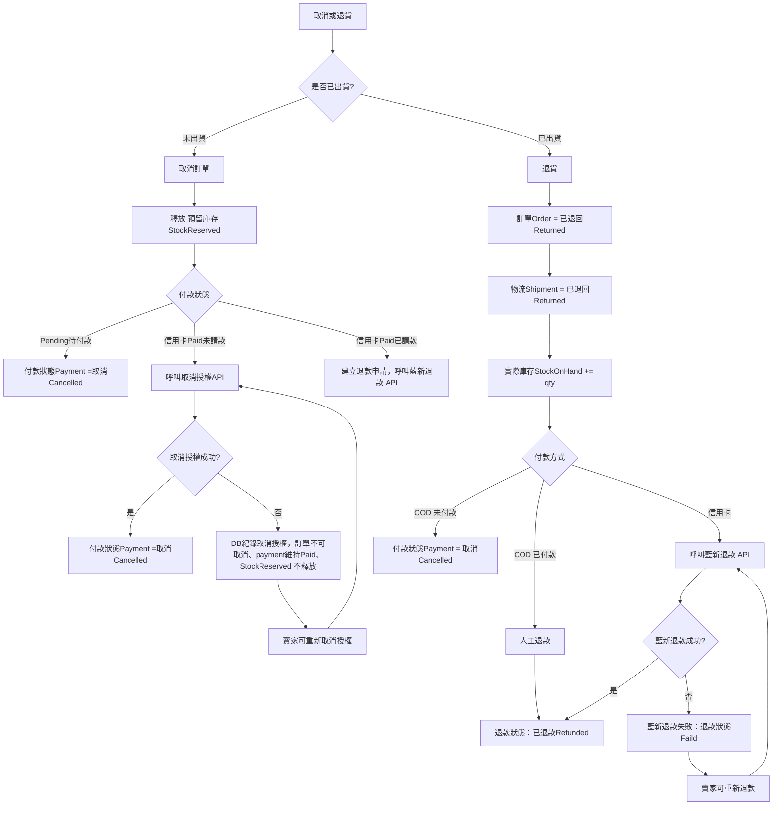

# 訂單流程圖

## 1. 下單流程

```mermaid
flowchart TD
    A[使用者下單] --> B[檢查商品是否上架]
    B --> C[檢查可售庫存]
    C --> D[建立訂單 Processing]
    D --> E[建立付款 Pending]
    E --> F[預留庫存 StockReserved += qty]
    F --> G[填寫物流資料]
    G --> H{付款方式}
    H -->|COD| I[回訂單列表]
    H -->|信用卡| J[導向藍新付款頁]
    J --> K{信用卡交易成功?}
    K -->|是| L[Notify 成功 Payment = Paid]
    K -->|否| M[Payment =Pending、訂單狀態 =Processing、不釋放預留庫存StockReserved，可重新付款]
    M --> N{付款是否逾時?}
    N -->|否| J
    N -->|是| O[系統自動取消訂單]
    O --> P[Payment = Cancelled]
    P --> Q[釋放 StockReserved]
```

## 2. 出貨流程

```mermaid
flowchart TD
    A[取得寄件代碼] --> B[訂單Order = 待出貨ReadyToShip]
    B --> C[模擬已寄件]
    C --> D{付款方式}
    D -->|COD| E[可出貨]
    D -->|信用卡| F[呼叫藍新請款]
    F --> G{請款成功?}
    G -->|是| E
    G -->|否| X[不可出貨，DB記錄請款失敗原因]
    X --> K[賣家可按重新請款]
    K --> F
    E --> H[訂單Order = 已出貨Shipped]
    H --> I[實際庫存StockOnHand -= qty]
    I --> J[預留庫存StockReserved -= qty]
```

## 3. 取消與退貨流程

```mermaid
flowchart TD
    A[取消或退貨] --> B{是否已出貨?}
    B -->|未出貨| C[取消訂單]
    C --> D[釋放 預留庫存StockReserved]
    D --> E{付款狀態}
    E -->|Pending待付款| K[付款狀態Payment =取消Cancelled]
    E -->|信用卡Paid未請款| L[呼叫取消授權API]
    L --> X{取消授權成功?}
    X -->|是| Y[付款狀態Payment =取消Cancelled]
    X -->|否| S[DB紀錄取消授權，訂單不可取消、payment維持Paid、StockReserved 不釋放]


    S --> T[賣家可重新取消授權]
    T --> L
    E -->|信用卡Paid已請款| M[建立退款申請，呼叫藍新退款 API]

    B -->|已出貨| F[退貨]
    F --> G[訂單Order = 已退回Returned]
    G --> H[物流Shipment = 已退回Returned]
    H --> I[實際庫存StockOnHand += qty]
    I --> J{付款方式}
    J -->|COD 未付款| N[付款狀態Payment = 取消Cancelled]
    J -->|COD 已付款| O[人工退款]
    O --> V
    J -->|信用卡| P[呼叫藍新退款 API]
    P --> Q{藍新退款成功?}
    Q --> |是| V[退款狀態：已退款Refunded]
    Q --> |否| U[藍新退款失敗：退款狀態Faild]
    U --> R[賣家可重新退款]
    R --> P
```
